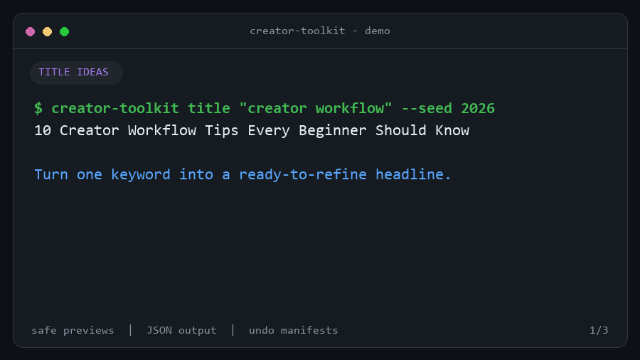

# Creator Toolkit CLI

[](https://github.com/HoungDev/creator-toolkit-cli/actions/workflows/python-ci.yml)
[](https://www.python.org/)
[](LICENSE)

A lightweight Python CLI for repeatable creator workflows. Generate content ideas and tags,
or normalize a folder of image names from an interactive menu or scriptable subcommands.



<sub>The demo uses disposable sample files. Title and tag suggestions vary during normal use.</sub>

## Why Creator Toolkit?

- Preview filename changes before touching a directory, then undo applied renames from a manifest.
- Automate every scriptable workflow with stable JSON schemas and meaningful exit codes.
- Get the same CLI behavior on current Windows, macOS, and Linux systems.
- Keep small creator tasks local, inspectable, and easy to compose in scripts.

## Real workflows

| Goal | Before | Example result |
| --- | --- | --- |
| Draft a title | `creator workflow` | `10 Creator Workflow Tips Every Beginner Should Know` |
| Pick three tags | `--count 3` | `automation`, `productivity`, `tutorial` |
| Preview image renames | `cover.jpg`, `thumbnail.png` | `image_1.jpg`, `image_2.png` — no files changed |

See the [demo transcript and reproduction steps](docs/demo.md).

## Features

- Generate title ideas from a keyword.
- Select unique tags from a curated list.
- Preview, apply, and undo deterministic JPEG and PNG filename changes.
- Use automation-friendly subcommands or an interactive menu.

## Requirements

- Python 3.11+
- A current Windows, macOS, or Linux system

See the [platform support policy](https://github.com/HoungDev/creator-toolkit-cli/blob/main/docs/platform-support.md)
for the tested OS/Python matrix and support expectations.

## Installation

Install from source in an isolated environment:

```bash
git clone https://github.com/HoungDev/creator-toolkit-cli.git
cd creator-toolkit-cli
python -m pip install .
```

## Usage

Generate a title or tags:

```bash
creator-toolkit title "video editing"
creator-toolkit tags --count 5
```

Add `--json` to any scriptable subcommand for automation-friendly output:

```bash
creator-toolkit title "video editing" --json
creator-toolkit tags --count 5 --json
creator-toolkit rename ./images --dry-run --json
```

See the [JSON output reference](https://github.com/HoungDev/creator-toolkit-cli/blob/main/docs/json-output.md)
for response schemas, exit codes, error handling, and automation examples.

Preview changes to `.jpg`, `.jpeg`, and `.png` files without touching the directory:

```bash
creator-toolkit rename ./images --dry-run
```

Apply the displayed plan after an interactive confirmation:

```bash
creator-toolkit rename ./images
```

For non-interactive automation, pass `--yes`. Every applied CLI rename writes a unique JSON
manifest in the image directory:

```bash
creator-toolkit rename ./images --yes
creator-toolkit undo ./images/.creator-toolkit-renames-20260807T120000Z-a1b2c3d4.json --dry-run
creator-toolkit undo ./images/.creator-toolkit-renames-20260807T120000Z-a1b2c3d4.json
```

The rename command orders inputs by filename and produces names such as `image_1.jpg`. Operations
use a two-phase rename to avoid collisions and roll back when a filesystem step fails. Undo
manifests reject path traversal and refuse to overwrite files created after the rename. Other
files are left untouched, but a separate backup is still recommended for valuable assets.

Run without a subcommand to use the interactive menu:

```bash
creator-toolkit
```

## Development

```bash
python -m pip install -e ".[dev]"
ruff check .
ruff format --check .
pytest
```

See [CONTRIBUTING.md](CONTRIBUTING.md) for the full contribution workflow. Bug reports and
focused pull requests are welcome.

Maintainers should follow the [release checklist](docs/releasing.md) and complete the
[one-time trusted publishing setup](docs/trusted-publishing.md) before publishing a version.

## License

[MIT](LICENSE) © 2026 HoungDev contributors.
